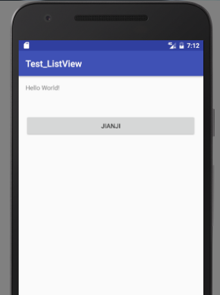
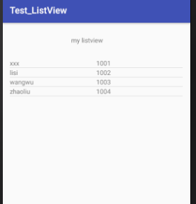
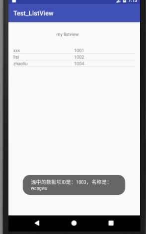

Android ListView
===

# activity

* MainActivity
* MyListView

# xml文件

* activity_main
有一个button用于跳转activity

* activity_my_list_view

```
<RelativeLayout 
    xmlns:android="http://schemas.android.com/apk/res/android"
    xmlns:tools="http://schemas.android.com/tools"
    android:id="@+id/activity_my_list_view"
    android:layout_width="match_parent"
    android:layout_height="match_parent"
    android:paddingBottom="@dimen/activity_vertical_margin"
    android:paddingLeft="@dimen/activity_horizontal_margin"
    android:paddingRight="@dimen/activity_horizontal_margin"
    android:paddingTop="@dimen/activity_vertical_margin"
    tools:context="com.example.yy.test_listview.MyListView">


    <TextView
        android:text="my listview"
        android:layout_width="wrap_content"
        android:layout_height="wrap_content"
        android:layout_alignParentTop="true"
        android:layout_alignParentStart="true"
        android:layout_marginStart="135dp"
        android:layout_marginTop="12dp"
        android:id="@+id/textView4" />

    <ListView
        android:id="@+id/abc_lv"
        android:layout_width="match_parent"
        android:layout_height="match_parent"
        android:layout_below="@+id/textView4"
        android:layout_marginTop="31dp" />
</RelativeLayout>
```

* item（对应ListView的数据项）
```
<LinearLayout 
    xmlns:android="http://schemas.android.com/apk/res/android"
    android:layout_width="match_parent"
    android:layout_height="match_parent"
    android:orientation="horizontal" >

    <TextView
        android:id="@+id/user_name"
        android:layout_width="match_parent"
        android:layout_height="match_parent"
        android:text="name"
        android:layout_weight="1"/>
    <TextView
        android:id="@+id/user_id"
        android:layout_width="match_parent"
        android:layout_height="match_parent"
        android:text="id"
        android:layout_weight="1"/>
</LinearLayout>
```
# AndroidManifest
注册2个activity:MainActivity和MyListView

# 切换activity
点击按钮实现切换：

MainActivity:
```
button的定义和声明不在一起

btn = (Button)findViewById(R.id.btn);

btn.setOnClickListener(new View.OnClickListener() {
    @Override
    public void onClick(View v) {

        //从MainActivity切换到MyListView
        Intent intent = new Intent(MainActivity.this, MyListView.class);

        startActivity(intent);
    }
});
```

# 给ListView布局

这里设置2列，一列为名字，另一列为对应ID
```
ListView lv;

lv = (ListView)findViewById(R.id.abc_lv);

//这里第一列所要显示的人名
String[] userName={"xxx","lisi","wangwu","zhaoliu"}; 

//这里是人名对应的ID
String[] userId={"1001","1002","1003","1004"};  

// 这里是ListView显示内容每一列的列名
String[] from={"name","id"};              

// item中控件的id
int[] to={R.id.user_name,R.id.user_id};   
```

## 给ListView绑定一个系统自带的SimpleAdapter适配器
```
lv = (ListView)findViewById(R.id.abc_lv);

ArrayList<HashMap<String,String>> listData = null;
listData = new ArrayList<HashMap<String,String>>();
for(int i=0; i<4; i++){
    HashMap<String,String> map=null;
    map=new HashMap<String,String>();       
    //为避免产生空指针异常，有几列就创建几个map对象
    map.put(from[0], userName[i]);
    map.put(from[1], userId[i]);
    listData.add(map);
}
// 创建一个SimpleAdapter对象
SimpleAdapter adapter = new SimpleAdapter(this, listData, R.layout.item, from, to);

// 为ListView设置适配器
lv.setAdapter(adapter);
```

## 给ListView绑定一个自定义的适配器
```
adapter = new MyAdapter(this);
lv.setAdapter(adapter);

static class ViewHolder
{
    public TextView name;
    public TextView id;
}

public class MyAdapter extends BaseAdapter {
    private LayoutInflater mInflater = null;
    private Context context;
    public MyAdapter(Context context)
    {
        this.context = context;
        this.mInflater = LayoutInflater.from(context);
    }
    @Override
    public int getCount() {
        // How many items are in the data set represented by this Adapter.(在此适配器中所代表的数据集中的条目数)
        return data.size();
    }
    @Override
    public Object getItem(int position) {
        // Get the data item associated with the specified position in the data set.(获取数据集中与指定索引对应的数据项)
        return data.get(position);
    }
    @Override
    public long getItemId(int position) {
        // Get the row id associated with the specified position in the list.(取在列表中与指定索引对应的行id)
        return position;
    }
    @Override
    public View getView(int position, View convertView, ViewGroup parent) {

        ViewHolder holder = null;
        //如果缓存convertView为空，则需要创建View
        if(convertView == null)
        {
            holder = new ViewHolder();
            //根据自定义的Item布局加载布局
            convertView = mInflater.inflate(R.layout.item, null);

            holder.name = (TextView)convertView.findViewById(R.id.user_name);
            holder.id = (TextView)convertView.findViewById(R.id.user_id);

            //将设置好的布局保存到缓存中，并将其设置在Tag里，以便后面方便取出Tag
            convertView.setTag(holder);
        }else
        {
            holder = (ViewHolder)convertView.getTag();
        }

        holder.name.setText((String)data.get(position).get("name"));
        holder.id.setText((String)data.get(position).get("id"));

        return convertView;
    }
}
```

## 点击ListView的每个item实现事件
```
protected void onCreate(Bundle savedInstanceState) {
    super.onCreate(savedInstanceState);
    setContentView(R.layout.activity_my_list_view);

    lv = (ListView)findViewById(R.id.abc_lv);

    data = getData();

    adapter = new MyAdapter(this);
    lv.setAdapter(adapter);

    lv.setOnItemClickListener(new AdapterView.OnItemClickListener() {
        @Override
        public void onItemClick(AdapterView<?> parent, View view, int position, long id) {
            String _name = (String)data.get(position).get("name");
            String _id = (String)data.get(position).get("id");

            String _text = "选中的数据项ID是：" + _id + "，名称是：" + _name;

            Toast toast=Toast.makeText(getApplicationContext(), _text, Toast.LENGTH_SHORT);
            toast.show();

            //实现点击删除item
            data.remove(position);// 删除数据后，需要刷新数据
            adapter.notifyDataSetChanged();
        }
    });
}
```
# 运行截图

* MainActivity：



* MyListView:



* MyListView删除item:



---
